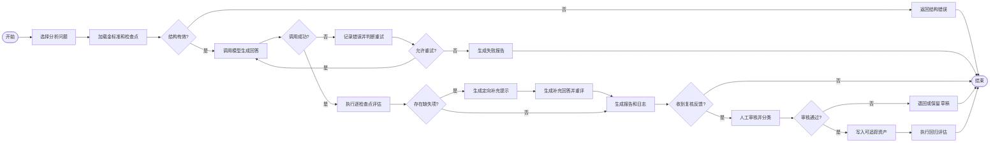

# GBSG2 AI数据分析质量评估与反馈产品 PRD

## 0. 文档信息

| 项目 | 内容 |
|---|---|
| 产品名称 | GBSG2 AI数据分析质量评估与反馈系统 |
| 产品类型 | 面向专业数据分析任务的离线AI评估、纠偏与知识资产化产品原型 |
| 文档版本 | PRD v1.0 |
| 文档日期 | 2026-09-29 |
| 产品负责人 | 张嘉懿 |
| 当前状态 | PRD已完成；产品化需求待按本PRD实施 |
| 已实现基线 | R统计金标准、5类问题、27个检查点、Python评估链路、GLM-4-Flash调用、定向补充、10条离线反馈资产、日志及Markdown/HTML报告 |

### 0.1 证据状态约定

- **数据来源事实**：由R官方数据文档或原始临床研究支持。
- **已实现基线**：由现有项目材料、运行日志和已确认事实支持。
- **PRD目标**：本文件定义的产品化需求、交互、异常处理或验收标准；不等同于已开发功能。

---

## 1. 产品背景

### 1.1 数据来源

GBSG2是R包 `TH.data` 和 `pec` 收录的German Breast Cancer Study Group 2数据。官方R文档记录了686名女性、8个预测字段，以及复发无病生存时间和删失/事件指示字段。数据字段包括激素治疗、年龄、绝经状态、肿瘤大小、肿瘤分级、阳性淋巴结数量、孕激素受体、雌激素受体、复发无病生存时间与事件状态。

原始研究为德国乳腺癌研究组开展的多中心随机试验，研究比较了淋巴结阳性乳腺癌患者不同化疗周期以及是否联合他莫昔芬的治疗方案。项目使用的是公开历史研究数据，不涉及新增患者招募或临床诊疗。

**来源口径说明：** R数据对象记录686名女性，scikit-survival文档进一步记录其中299人发生复发无病生存终点事件；1994年原始试验论文摘要则报告473名随机入组患者。两者不是可以直接互换的样本口径。本产品以R/scikit-survival文档作为当前数据对象的样本量、字段和事件数依据，以原始论文说明研究背景，不将686条R数据记录直接表述为论文摘要中的473名随机入组队列。

### 1.2 业务问题

通用大语言模型可以生成统计分析回答，但在专业数据分析任务中存在以下产品问题：

1. 用户难以判断回答是否覆盖关键方法、指标口径、诊断和限制。
2. 单一总分无法定位错误发生在哪个检查点，也无法指导针对性修正。
3. 用户纠错容易停留在单次对话，无法形成可复用、可追踪的知识资产。
4. 统计计算、LLM生成和评估逻辑混在一起时，模型或统计实现难以独立替换。
5. 关键字命中可以验证基础覆盖，却不足以承担完整语义和数值事实判断。

### 1.3 产品机会

将专业问题拆成结构化金标准和可定位检查点，通过“生成—评估—缺口补充—重评—反馈资产化”流程，把AI数据分析能力从主观印象转化为可检查、可复测、可追踪的产品机制。

---

## 2. 产品目标与非目标

### 2.1 产品目标

1. 让评估人员能够选择一个已定义的生存分析问题，调用模型并查看逐检查点结果。
2. 让统计专家能够维护版本化金标准、方法口径、诊断结论和数据限制。
3. 对缺失检查点生成定向补充提示，并将首次回答与补充回答分开留痕。
4. 将人工确认的纠错沉淀为可追踪、可去重、可回归验证的知识资产。
5. 让每次运行能够追溯到数据版本、金标准版本、模型配置、评估规则和反馈资产版本。
6. 输出可供产品、统计与工程角色共同审阅的检查点日志和评估报告。

### 2.2 非目标

以下内容不属于本PRD v1.0的产品结果范围：

- 为患者提供诊断、预后判断或治疗建议；
- 用检查点覆盖率代替临床正确性、总体模型准确率或全部事实正确率；
- 自动接受未经人工审核的用户反馈；
- 使用GBSG2结果推断其他人群或现实医疗产品效果；
- 替代统计专家、临床专家或正式模型验证流程。

---

## 3. 数据字典与分析任务

### 3.1 GBSG2字段

| 字段 | 类型 | 含义 |
|---|---|---|
| `horTh` | 分类 | 是否接受激素治疗：no / yes |
| `age` | 数值 | 年龄，单位为岁 |
| `menostat` | 分类 | 绝经状态：pre / post |
| `tsize` | 数值 | 肿瘤大小，单位为毫米 |
| `tgrade` | 有序分类 | 肿瘤分级：I < II < III |
| `pnodes` | 数值 | 阳性淋巴结数量 |
| `progrec` | 数值 | 孕激素受体，单位为fmol |
| `estrec` | 数值 | 雌激素受体，单位为fmol |
| `time` | 数值 | 复发无病生存时间，单位为天 |
| `cens` | 二元 | 0为删失，1为发生事件 |

### 3.2 产品内置分析问题

| 问题ID | 问题类型 | 检查点数 | 能力覆盖 |
|---|---|---:|---|
| Q01 | Cox主分析 | 7 | 方法选择、效应量、区间估计、解释与限制 |
| Q02 | 独立预后因素 | 4 | 多变量解释、变量筛选和结论表达 |
| Q03 | 变量编码选择 | 5 | 连续/分类/有序变量处理及口径判断 |
| Q04 | PH假设与分层敏感性 | 5 | 假设诊断、分层比较与稳健性说明 |
| Q05 | Random Survival Forest与Cox比较 | 6 | 模型比较、评价维度、适用条件与边界 |
| 合计 | 5类问题 | 27 | 会算、会解释、会诊断、会声明边界 |

---

## 4. 用户角色

> 以下为产品角色设计，不代表现有项目已有真实跨团队参与。

### 4.1 评估人员

- 目标：选择问题、调用模型、查看缺口、比较运行结果并导出报告。
- 核心痛点：模型回答看似完整，但缺少可定位的质量判断。
- 权限：发起运行、查看结果、提交反馈、导出报告。

### 4.2 统计专家

- 目标：维护金标准、检查点、方法口径、诊断和限制。
- 核心痛点：专业标准变更难以同步到模型评估流程。
- 权限：创建或修改草稿版本、审核反馈、发布金标准版本、执行回归评估。

### 4.3 产品质量负责人

- 目标：定义评估范围、检查失败类型、管理反馈资产和版本发布。
- 核心痛点：总分无法解释失败原因，反馈也难以复用。
- 权限：配置评估规则、审批资产、比较版本、查看质量趋势。

### 4.4 模型/应用工程人员

- 目标：配置模型端点、定位调用异常、核查输入输出和运行日志。
- 核心痛点：统计逻辑与模型接入耦合时，替换成本和排障成本较高。
- 权限：维护模型配置、查看技术日志、执行诊断运行；无权直接发布统计金标准。

---

## 5. 核心使用场景

### 场景A：评估一次AI分析回答

评估人员选择Q01–Q05中的问题，系统加载对应金标准和检查点，调用模型生成回答，输出逐检查点结果、缺失项、触发的高风险值及运行元数据。

### 场景B：针对缺口补充并重新评分

当首次回答存在未覆盖检查点时，系统生成仅包含缺失项的定向补充提示，保留原回答并追加补充内容，再次执行检查点评估。

### 场景C：把人工纠错沉淀为资产

评估人员提交纠错，统计专家审核后将其归类为指标口径、方法知识或Few-shot示例；系统生成唯一资产ID，保留反馈来源、版本和适用问题范围。

### 场景D：比较版本和导出报告

用户比较首次回答、补充回答、不同资产版本或模型配置的检查点结果，并导出Markdown或HTML报告。

---

## 6. 用户故事

| ID | 用户故事 | 优先级 |
|---|---|---|
| US-01 | 作为评估人员，我希望查看数据来源、字段和问题定义，以确认分析上下文。 | P0 |
| US-02 | 作为评估人员，我希望选择一个分析问题并调用已配置模型，以获得可评估回答。 | P0 |
| US-03 | 作为评估人员，我希望查看27个检查点中的逐项结果，以定位缺失或风险。 | P0 |
| US-04 | 作为评估人员，我希望只针对未覆盖检查点发起补充生成，以降低无关改写。 | P0 |
| US-05 | 作为统计专家，我希望维护版本化金标准和检查点，以保证评估口径可追溯。 | P0 |
| US-06 | 作为统计专家，我希望审核纠错并决定是否资产化，以阻止错误反馈污染知识库。 | P0 |
| US-07 | 作为质量负责人，我希望比较首次与补充后的检查点结果，以识别改进来源。 | P0 |
| US-08 | 作为质量负责人，我希望资产写入具备幂等性，以避免重复反馈生成重复资产。 | P0 |
| US-09 | 作为工程人员，我希望每次调用都记录模型、配置、时间和错误类型，以支持排障。 | P1 |
| US-10 | 作为评估人员，我希望导出Markdown和HTML报告，以便复核与沟通。 | P1 |
| US-11 | 作为质量负责人，我希望对不同模型和多次运行进行比较，以评估稳定性和成本。 | P2 |
| US-12 | 作为统计专家，我希望增加语义与数值一致性检查，以补充关键字评估。 | P2 |

---

## 7. 功能需求

### 7.1 工作台与问题选择

**FR-01 数据来源卡片**

- 展示数据集名称、版本、样本量、事件数、字段字典和来源链接。
- 明确分析终点为复发无病生存时间。
- 显示当前问题、金标准版本、评估器版本和资产版本。

**FR-02 问题列表**

- 展示Q01–Q05、问题名称、检查点数、最近运行状态。
- 支持进入问题详情，查看问题文本、方法要求、检查点与限制。

### 7.2 金标准与检查点管理

**FR-03 金标准版本**

- 金标准至少包含问题ID、版本、方法、关键结果、诊断、限制和检查点集合。
- 版本发布后不可原地覆盖；修改必须创建新版本。
- 每个版本记录创建人、审核人、时间和变更说明。

**FR-04 检查点规则**

- 支持关键词AND、同义表达OR和配置禁用数值三类基础规则。
- 每个检查点具有唯一ID、名称、规则类型、严重度和证据说明。
- 检查点结果包括通过、未通过、需人工复核三种状态。

### 7.3 模型生成与运行管理

**FR-05 模型配置**

- 支持OpenAI兼容端点配置。
- 密钥通过环境变量或安全配置读取，不写入报告和普通日志。
- 每次运行记录provider、model、prompt版本、参数、开始/结束时间和run ID。

**FR-06 首次生成**

- 使用已发布问题版本和Prompt版本发起生成。
- 原始回答只读保存，不被补充回答覆盖。
- 模型响应为空、结构异常或调用失败时进入异常状态。

### 7.4 评估、补充与重评

**FR-07 逐检查点评估**

- 对回答执行27项中与当前问题对应的检查点。
- 输出逐项状态、命中证据、缺失信息和触发的高风险数值。
- 汇总结果使用“通过检查点数/适用检查点数”，不得标为模型准确率。

**FR-08 定向补充**

- 当存在未通过检查点时，可生成仅包含缺失项的补充提示。
- 补充回答与首次回答分开保存，并标记父run ID。
- 重评报告同时展示首次结果、补充内容和最终检查点状态。

**FR-09 人工复核**

- 对禁用数值命中、规则冲突或低置信语义匹配标记“需人工复核”。
- 人工复核必须记录结论、理由和复核人。

### 7.5 反馈与知识资产化

**FR-10 反馈提交**

- 反馈包含问题ID、检查点ID、原回答片段、纠正内容、反馈类型和来源说明。
- 未关联检查点的反馈可保存为草稿，但不能直接发布为资产。

**FR-11 反馈审核**

- 统计专家可以接受、拒绝或退回修改。
- 接受时必须选择资产类别：指标口径、方法知识或Few-shot示例。

**FR-12 资产写入**

- 每条资产具有唯一asset ID、来源feedback ID、版本、适用范围和状态。
- 重复处理相同feedback ID不得生成第二条有效资产。
- 资产更新后必须触发指定问题集的回归评估。

### 7.6 报告与审计

**FR-13 运行详情**

- 展示问题、模型、Prompt、金标准、评估器和资产版本。
- 展示原始回答、补充回答、逐检查点结果和异常记录。

**FR-14 报告导出**

- 支持Markdown和HTML格式。
- 报告区分真实LLM运行与确定性机制验证。
- 报告包含数据来源、运行范围、检查点定义和结果解释。

**FR-15 版本比较**

- 支持按run ID比较首次与补充结果。
- P2阶段支持跨模型、多轮运行、Prompt版本和资产版本比较。

---

## 8. 页面与信息架构

1. **首页/工作台**：数据来源、五类问题、最近运行、待审核反馈。
2. **问题详情**：问题定义、金标准版本、检查点列表、历史运行。
3. **发起评估**：模型配置、Prompt版本、运行确认。
4. **运行结果**：回答正文、检查点矩阵、缺口、异常和补充入口。
5. **反馈审核**：原文、纠错、分类、适用范围、接受/拒绝。
6. **资产库**：三类资产、来源关系、版本和回归状态。
7. **报告中心**：运行报告、版本比较和导出。
8. **配置中心**：provider、model、规则版本和安全配置状态。

### 8.1 关键页面状态

每个主要页面至少包含：

- 初始状态；
- 加载状态；
- 空状态；
- 成功状态；
- 部分成功状态；
- 可重试错误；
- 不可重试错误；
- 权限不足状态。

---

## 9. 端到端流程图

---

## 10. 异常状态与处理

| 异常ID | 触发条件 | 用户提示 | 系统处理 | 是否可重试 |
|---|---|---|---|---|
| EX-01 | 金标准文件缺失 | 当前问题缺少可用金标准 | 阻止运行并记录问题ID | 否，需管理员修复 |
| EX-02 | JSON Schema校验失败 | 金标准结构不符合当前版本 | 返回字段级错误和schema版本 | 否，需修复文件 |
| EX-03 | 检查点为空或数量不一致 | 检查点配置异常 | 阻止发布或运行 | 否 |
| EX-04 | 模型密钥缺失 | 模型配置不可用 | 不发起外部请求；不展示密钥内容 | 否，需配置 |
| EX-05 | 模型超时或限流 | 模型暂时不可用 | 保存失败状态、错误码和重试次数 | 是 |
| EX-06 | 模型返回空文本 | 未获得有效回答 | 保存原始响应元数据并允许重试 | 是 |
| EX-07 | 回答包含配置禁用数值 | 检测到高风险数值 | 标记需人工复核，不自动判定事实正确 | 是，复核后处理 |
| EX-08 | 规则冲突 | 同一检查点出现相互冲突的信号 | 状态设为需人工复核 | 否，需人工判断 |
| EX-09 | 补充生成再次缺失 | 补充后仍有未覆盖项 | 保留两次结果并停止自动循环 | 可人工再次发起 |
| EX-10 | 重复feedback ID | 该反馈已处理 | 返回已有asset ID，不重复写入 | 否 |
| EX-11 | 资产范围冲突 | 新资产与现有口径矛盾 | 阻止发布并创建冲突任务 | 否，需专家审核 |
| EX-12 | 报告生成失败 | 结果已保存，报告暂未生成 | 保留run结果并允许重新导出 | 是 |
| EX-13 | 回归评估失败 | 新资产未通过回归检查 | 资产保持草稿或回滚到上一版本 | 是 |
| EX-14 | 权限不足 | 当前账号无权执行此操作 | 拒绝请求并记录审计事件 | 否 |

---

## 11. 验收条件

### 11.1 数据与金标准

- AC-01：系统能够加载686条GBSG2记录及10个官方字段，字段类型与数据字典一致。
- AC-02：系统能够加载Q01–Q05五个问题及合计27个检查点，单题检查点数分别为7、4、5、5、6。
- AC-03：缺失必填字段、未知schema版本或检查点数量不一致时，运行被阻止并返回字段级错误。
- AC-04：发布后的金标准不能原地覆盖；创建新版本后仍能查看旧版本运行记录。

### 11.2 模型生成与评估

- AC-05：成功运行必须生成唯一run ID，并记录问题、模型、Prompt、金标准、评估器和资产版本。
- AC-06：模型原始回答只读保存；补充回答以子运行或关联记录保存，不覆盖原文。
- AC-07：评估结果必须逐项展示检查点状态和命中证据，不只提供总分。
- AC-08：检查点汇总统一标为覆盖情况，不使用“模型准确率”作为字段名称。
- AC-09：模型调用失败时，系统不得生成成功报告；错误类型和重试状态必须可见。
- AC-10：存在缺失检查点时，可生成仅包含缺失项的定向补充提示，并在重评报告中区分首次与补充结果。
- AC-11：禁用数值命中或规则冲突时，结果进入“需人工复核”，系统不自动升级为事实错误或事实正确。

### 11.3 反馈与资产化

- AC-12：未经审核的反馈不能进入有效资产库。
- AC-13：审核通过的反馈必须生成asset ID，并保留来源feedback ID、类别、版本和适用范围。
- AC-14：对同一feedback ID重复执行写入，系统返回原asset ID且有效资产数量不增加。
- AC-15：发布新资产前必须执行回归评估；失败时资产不得进入生效状态。
- AC-16：指标口径、方法知识和Few-shot示例三类资产可以独立筛选和追溯。

### 11.4 报告与审计

- AC-17：Markdown与HTML报告均包含数据来源、运行配置、检查点明细、首次/补充结果和异常信息。
- AC-18：确定性机制验证和真实LLM运行在报告中使用不同运行类型，不合并计算结果。
- AC-19：导出报告不得包含API密钥、访问令牌或其他秘密配置。
- AC-20：任一结果可以从run ID追溯到对应问题、金标准、Prompt、模型、评估器和资产版本。

### 11.5 当前基线回归验收

- AC-21：确定性机制验证能够复现资产应用前13/27、应用后27/27的已记录检查点覆盖结果。
- AC-22：已记录的GLM-4-Flash运行能够分别展示首次21/27和定向补充后27/27的检查点结果，并标记为单次运行记录。
- AC-23：10条现有离线反馈可以映射到三类资产，并通过feedback ID与asset ID完成追踪。
- AC-24：五个版本化统计金标准能够生成同一套27项Python评估集。

---

## 12. 非功能需求

### 12.1 可追溯性

- 所有问题、金标准、Prompt、评估器、模型配置和资产均具有版本号。
- 所有运行、反馈、审核、发布和回滚动作均记录时间及操作者。

### 12.2 可复现性

- 确定性机制验证在相同输入、版本和配置下输出一致结果。
- 随机模型运行保留完整配置和原始回答，不用单次结果代替稳定性结论。

### 12.3 安全与隐私

- 密钥仅通过安全配置读取，不写入普通日志、报告或代码仓库。
- 产品只使用公开历史数据及结构化分析结果，不增加个人身份信息。
- 报告页面固定展示数据来源、分析终点和产品用途说明。

### 12.4 可维护性

- R统计层与Python/LLM产品层通过版本化JSON接口解耦。
- 新增问题时应通过配置和schema扩展，不修改已有运行记录。
- 规则、Prompt和资产更新必须具备回归测试与回滚能力。

---

## 13. 埋点与产品指标

### 13.1 建议埋点

| 事件 | 触发时机 | 关键属性 |
|---|---|---|
| `question_viewed` | 打开问题详情 | question_id、gold_version |
| `run_started` | 发起模型运行 | run_id、provider、model、prompt_version |
| `provider_failed` | 模型调用失败 | error_type、retry_count |
| `evaluation_completed` | 检查点评估结束 | initial_passed、applicable_count、review_count |
| `supplement_started` | 发起定向补充 | missing_count、parent_run_id |
| `report_exported` | 导出报告 | format、run_id |
| `feedback_submitted` | 提交纠错 | checkpoint_id、feedback_type |
| `feedback_reviewed` | 完成审核 | decision、reviewer_role |
| `asset_created` | 资产写入 | asset_type、source_feedback_id |
| `regression_completed` | 回归评估结束 | affected_questions、result |

### 13.2 产品化阶段评价指标

以下指标用于后续真实使用阶段，不属于当前项目结果：

- 任务完成率；
- 单次评估完成时间；
- 人工复核率与纠错率；
- 评估器与人工判断一致率；
- 反馈审核通过率；
- 反馈到资产的处理时间；
- 资产复用次数与回归失败率；
- 重复使用率和报告采纳率；
- 多模型、多轮运行的检查点覆盖均值与波动；
- 单次运行成本和模型调用失败率。

---

## 14. 发布规划

### Phase 0：已实现机制基线

- R金标准与JSON接口；
- 5类问题与27个检查点；
- 启发式检查点评估；
- GLM-4-Flash单次运行及定向补充；
- 10条离线反馈资产；
- 确定性机制验证；
- 检查点日志及Markdown/HTML报告。

### Phase 1：PRD产品化

- 工作台、问题详情和运行结果页面；
- 金标准、Prompt、评估器和资产版本管理；
- 异常状态、人工复核和报告中心；
- 埋点、审计日志和回归测试入口。

### Phase 2：封闭用户验证

- 邀请数据分析人员和统计背景用户完成任务；
- 记录任务完成、理解障碍、人工复核和反馈质量；
- 依据真实使用结果迭代信息架构、检查点解释和反馈流程。

### Phase 3：质量能力扩展

- 语义评估与全量数值一致性检查；
- DeepSeek、豆包和OpenAI等模型的实际接入与横向比较；
- 多轮稳定性、成本、延迟和异常监控；
- 版本灰度、回滚和线上反馈治理。

---

## 15. 风险与缓解措施

| 风险 | 影响 | 缓解措施 |
|---|---|---|
| 关键字通过但事实错误 | 结果被误读为正确 | 增加人工复核状态；P2扩展语义和数值一致性检查 |
| 金标准错误或过期 | 错误被系统化放大 | 专家审核、版本管理、变更记录和回归测试 |
| 反馈污染资产库 | 后续回答质量下降 | 审核后发布、来源追踪、冲突检查和回滚 |
| 针对固定27项过拟合 | 新问题迁移能力不足 | 建立独立验证问题集和跨问题回归评估 |
| 单次LLM结果波动 | 无法判断稳定性 | 保留完整运行配置，后续开展多轮比较 |
| 临床语境被错误外推 | 产生不当决策 | 固定数据来源和用途说明，禁止诊断或治疗输出 |
| 多模型配置泄露密钥 | 安全风险 | 环境变量、密钥脱敏和导出检查 |

---

## 16. 依赖与待决策项

### 16.1 依赖

- R统计金标准生成脚本及版本文件；
- Python评估、反馈和报告模块；
- OpenAI兼容模型端点；
- 安全的密钥与配置管理；
- 可持久化的运行、反馈、资产和审计存储；
- 统计专家或具备生存分析能力的审核角色。

### 16.2 待决策项

1. 产品化首版采用本地应用、内部Web工具还是托管Demo。
2. 金标准发布是否需要双人审核。
3. 语义评估采用LLM-as-judge、人工抽检还是混合方案。
4. 多模型比较的首要目标是质量、成本还是延迟。
5. 封闭测试的目标用户数量、招募条件和隐私告知方式。

---

## 17. 来源

- [R官方文档：TH.data::GBSG2](https://search.r-project.org/CRAN/refmans/TH.data/html/GBSG2.html)
- [R官方文档：pec::GBSG2](https://search.r-project.org/CRAN/refmans/pec/html/GBSG2.html)
- [scikit-survival数据文档：686个样本、8个预测字段、299个终点事件](https://scikit-survival.readthedocs.io/en/stable/api/generated/sksurv.datasets.load_gbsg2.html)
- [PubMed：Schumacher et al., 1994](https://pubmed.ncbi.nlm.nih.gov/7931478/)
- [Journal of Clinical Oncology原始研究](https://ascopubs.org/doi/10.1200/JCO.1994.12.10.2086)

## 18. 简历使用边界

本PRD完成后，可以真实表述“基于现有可运行原型补充完成产品需求文档、用户角色、流程、异常状态和验收标准设计”。在Phase 1、Phase 2或Phase 3实际完成前，不将对应页面开发、用户测试、多模型实测或生产监控写成已交付结果；可将其作为明确的未来优化路线呈现。
