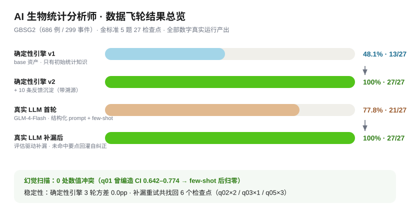
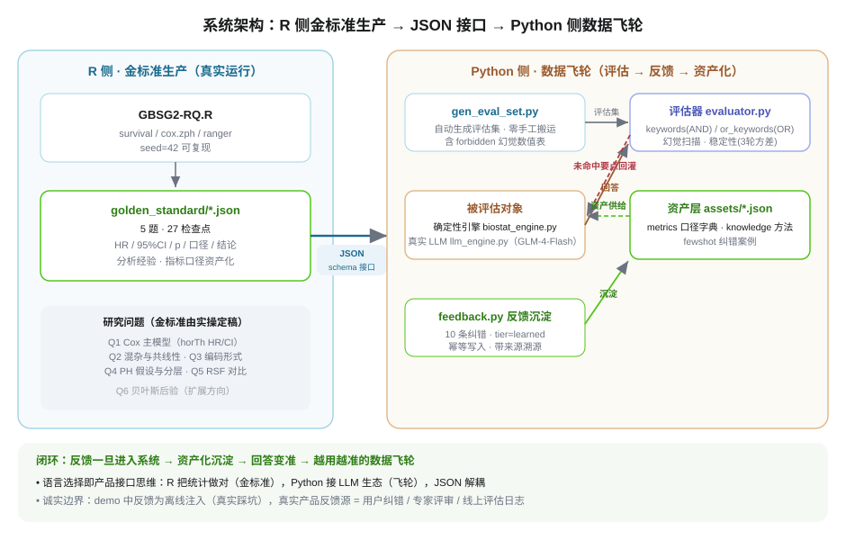

# AI 数据产品经理作品集 Demo —— 数据飞轮

> **一句话定位**：用公开生物统计数据集 GBSG2 演示"数据回流与反馈机制 / 分析经验·指标口径·业务知识资产化 / 越用越准的数据飞轮"——把 JD 里那句抽象描述，变成可复现、可量化、有真实 LLM 接入的运行系统。

    

**数据集**：GBSG2（德国乳腺癌研究组，686 例，299 复发事件，`TH.data::GBSG2`）
**角色代入**：模拟"AI 数据分析产品"的完整链路——R 侧产出分析金标准，Python 侧搭建评估 + 反馈 + 资产化闭环，真实大模型（GLM-4-Flash）作为被评估的 AI 分析师。

---

## 一、核心结果

| 链路 | 版本 | 准确率 | 检查点 | 幻觉 |
|---|---|---|---|---|
| 确定性引擎（机制证明） | v1 base 资产 | 48.1% | 13/27 | — |
| 确定性引擎（机制证明） | v2 +10 条反馈沉淀 | **100%** | 27/27 | 0 |
| 真实 LLM（GLM-4-Flash） | 首轮 | 77.8% | 21/27 | 0 |
| 真实 LLM（GLM-4-Flash） | 评估驱动补漏 | **100%** | 27/27 | 0 |

**一句话结论**：反馈一旦进入系统，系统就能承接、沉淀、变准——飞轮转起来了。



---

## 二、系统架构



**语言选择即产品接口思维**：R 负责"把统计做对"（金标准），Python 负责"把 LLM 生态接进来"（飞轮），中间只靠标准 JSON 解耦——任何一侧换实现都不影响另一侧。

---

## 三、三步复现

### 0. 前置
- R ≥ 4.x：`install.packages(c("TH.data", "survival", "survminer", "ranger"))`
- Python 3.10+：`pip install openai`（仅真实 LLM 需要；确定性引擎零依赖）

### 1. 金标准（R，可选——已落盘可直接用）
```r
source("GBSG2-RQ.R")   # 重新跑出 golden_standard/（seed=42 可复现）
```

### 2. 确定性飞轮（零 API，秒级）
```bash
cd flywheel
python run_demo.py        # v1 48.1% → 反馈沉淀 → v2 100%，生成 report.md/html
```

### 3. 真实 LLM 飞轮（需 API key）
```bash
export LLM_API_KEY=<智谱开放平台 key>   # 免费模型 glm-4-flash
python run_demo_llm.py zhipu --rounds 1   # 首轮 77.8% → 补漏 100%，幻觉 0
```
支持 provider：`zhipu` / `deepseek` / `doubao` / `openai`（`llm_engine.py` 内配置）。

---

## 四、面试话术速查

**Q：什么叫"设计数据回流与反馈机制，形成越用越准的数据飞轮"？**
> 我用 GBSG2 把这个抽象概念做成了可运行的系统。核心是四件事：
> 1. **金标准资产化**：把分析结论（HR=0.707、CI、口径、PH 检验）结构化存成 JSON——分析经验沉淀；
> 2. **评估体系**：27 个检查点按关键字匹配 + 幻觉扫描（forbidden 数值表）衡量"准不准"；
> 3. **反馈闭环**：10 条带溯源的纠错（真实踩坑：列名、OOB 口径、共线性、PH 分层）沉淀为资产，引擎从 48.1% 涨到 100%；
> 4. **真实模型验证**：GLM-4-Flash 接入后暴露真问题——编造 CI、漏点——用 few-shot + 评估驱动补漏把 77.8% 拉到 100%，幻觉归零。

**Q：怎么判断 AI 能承担到什么程度？（机会识别与边界管理）**
> demo 里 q01–q05 的边界就是证据：Cox 数值结论（HR/CI）LLM 需要 few-shot 才能说准；方法学诊断（PH 违反的解读、显著≠预测重要）需要评估补漏才补齐；数据局限声明是资产层强制的。**能承担的程度 = 金标准覆盖的检查点能通过多少**，这正是评估体系的价值——边界不是拍脑袋，是测出来的。

**Q：产品路线图怎么定？**
> 路线图 = 评估集扩展路线。当前 5 题 27 检查点，下一步加 Q6 贝叶斯后验（PyMC）就是"扩展一类分析能力"：金标准照旧产 → 评估集自动扩一张 → 飞轮继续转。每个路线图条目都可以对应一个"新增评估维度"。

**Q：为什么 R 和 Python 混用？**
> 这是产品接口思维：R 把统计做对，Python 接 LLM 生态，中间用 JSON 解耦。真实团队里也是这样分工——统计科学家和工程各管一侧，接口先行。

---

## 五、诚实的边界（面试加分细节）

- **反馈是离线注入的**（来自真实踩坑经验，通过 `feedback.py` 幂等沉淀），不是运行时自动产生；demo 证明的是"反馈一旦进来系统能承接、沉淀、变准"。真实产品中反馈源 = 用户纠错 / 专家评审 / 线上评估日志。
- **评估器是关键字匹配**，不是语义理解——所以才有 or_keywords 同义词迭代；真实产品会用 LLM-as-judge。
- **单轮 LLM 成绩有噪声**（74%–78% 波动），产品上会用 pass@k（多次采样取最优）平滑。
- **确定性引擎是 mock**：它证明机制（反馈→资产→变准）成立；真实准确性以 LLM 链路为准。

---

## 六、目录结构

```
GBSG2-Demo/
├── GBSG2-RQ.R                  # R 金标准生产脚本（seed=42）
├── golden_standard/            # 5 题 27 检查点 JSON + index.md
├── flywheel/
│   ├── gen_eval_set.py         # golden_standard → 评估集（含 forbidden 幻觉表）
│   ├── biostat_engine.py       # 确定性引擎（base/full 两层资产召回）
│   ├── evaluator.py            # keywords(AND)/or_keywords(OR)/forbidden 打分
│   ├── feedback.py             # 反馈幂等沉淀（tier=learned, 带溯源）
│   ├── llm_engine.py           # 真实 LLM 接入（urllib 直连, 多 provider）
│   ├── run_demo.py             # 确定性飞轮主流程 + 报告
│   ├── run_demo_llm.py         # 真实 LLM + 评估驱动补漏
│   ├── assets/                 # 资产层：metrics / knowledge / fewshot / eval_set
│   └── data/                   # feedback.jsonl / inferences_*.jsonl
└── report.md / report.html     # 双链 100% 最终报告
```
